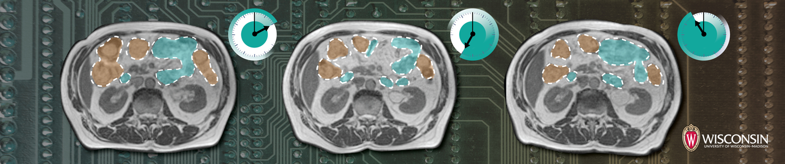

  

<h1 align="center">Medica Image Segmentation</h1>

This repository serves as the template , focusing on medical image segmentation. Explore and utilize this template to kickstart your own medical image segmentation projects, leverage best practices, and accelerate your journey into the world of precise medical diagnostics through deep learning.

## 1. Problem Statement
develop a medical image segmentation system that can accurately identify and segment healthy organs in medical scans, with the goal of improving cancer treatment. The system should be able to analyze various types of medical imaging data, such as CT scans or MRI scans, and accurately delineate the boundaries of healthy organs.

### Challenges:

* **Variability in Image Characteristics:** Medical images can vary in terms of resolution, contrast, noise, and artifacts. These variations pose challenges in accurately segmenting healthy organs, as the boundaries may not be clearly defined.

* **Interpatient Variability:** Each patient's anatomy can differ, making it challenging to develop a generalized segmentation model. The system needs to adapt to different patient populations and account for anatomical variations.

* **Complex Organ Structures:** Some organs, such as the liver or brain, have complex structures with intricate boundaries. Accurately segmenting these organs requires advanced algorithms that can handle complex anatomical shapes.

* **Limited Training Data:** Annotated medical image data for training segmentation models is often limited and requires expert annotation. Acquiring large-scale annotated datasets can be challenging, leading to potential limitations in model performance.

* **Real-time Processing:** In a clinical setting, real-time processing is crucial to support efficient diagnosis and treatment planning. The segmentation system should provide fast and accurate results within a clinically acceptable timeframe.

### Goals:

* **Accurate Segmentation:** The primary goal is to develop a segmentation system that can accurately identify and segment healthy organs in medical scans. The system should provide precise boundaries for further analysis and treatment planning.

* **Robustness and Generalization:** The system should be robust to handle variations in image characteristics and adapt to different patient populations. It should generalize well to unseen data and be effective across different medical imaging modalities.

* **Efficiency:** The segmentation system should be efficient in terms of computational resources and processing time. Real-time or near-real-time segmentation is desirable to support timely decision-making in a clinical setting.

* **Integration with Clinical Workflow:** The system should be seamlessly integrated into the clinical workflow, allowing medical professionals to easily access and utilize the segmented organ information. The output should be compatible with existing medical imaging systems and tools.

* **Performance Evaluation:** A comprehensive evaluation of the segmentation system is necessary to assess its accuracy and performance. It should be compared against ground truth annotations and evaluated using appropriate metrics such as Dice coefficient, Hausdorff distance, or other domain-specific evaluation measures.

## 2. Related Works
This section explores existing research and solutions related to medical image segmentation. 

## 3. The Proposed Method
Here, the proposed approach for solving the problem is detailed. It covers the algorithms, techniques, or deep learning models to be applied, explaining how they address the problem and why they were chosen.

## 4. Implementation
This section delves into the practical aspects of the project's implementation.

### 4.1. Dataset
Under this subsection, you'll find information about the dataset used for the medical image segmentation task. It includes details about the dataset source, size, composition, preprocessing, and loading applied to it.
[Dataset](https://drive.google.com/file/d/1-2ggesSU3agSBKpH-9siKyyCYfbo3Ixm/view?usp=sharing)

### 4.2. Model
In this subsection, the architecture and specifics of the deep learning model employed for the segmentation task are presented. It describes the model's layers, components, libraries, and any modifications made to it.

### 4.3. Configurations
This part outlines the configuration settings used for training and evaluation. It includes information on hyperparameters, optimization algorithms, loss function, metric, and any other settings that are crucial to the model's performance.

### 4.4. Train
Here, you'll find instructions and code related to the training of the segmentation model. This section covers the process of training the model on the provided dataset.

### 4.5. Evaluate
In the evaluation section, the methods and metrics used to assess the model's performance are detailed. It explains how the model's segmentation results are quantified and provides insights into the model's effectiveness.

